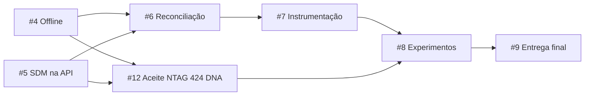

# Entregas atuais e pendências

Atualização aprovada pelo mantenedor em 6 de outubro de 2026. A branch publicada
é `codex/issue-4-durable-offline`; sua integração na main continua em PR separado.

As issues #1 (adaptador/diagnóstico/perfil candidato), #2 (fluxo online UID/NDEF)
e #3 (login/permissões/SecureStore) registram o software concluído. Foram aprovadas
pelo mantenedor para publicação, com 203 testes mobile e 70 da API passando
localmente. Não houve aprovação física de NTAG 424 DNA nem revisão independente
atribuída ao colega.

A #4 acrescenta fila SQLite, cache por operador/API de vínculos ativos (24 horas),
recuperação após reinício, envio em lote, reautenticação e a aba **Envios**. Veja
[implementação e aceite offline](11-captura-offline.md). Atualizar o development
build iOS é necessário para SQLite/rede; nenhum build EAS foi iniciado.
Verificação atual: 221 testes mobile/23 suítes e 76 testes API/7 suítes. APK
Android local validou SQLite/SecureStore, abertura fria/reinício sem API,
reconexão, resposta perdida após commit e isolamento/logout. Entradas do ensaio
foram sintéticas; não representam aceite físico NFC.

Personalização autenticada, proteção reversível, recuperação e roteiro físico dos
três tratamentos foram concentrados na
[#12](https://github.com/Joao-AugustoPF/nfc-trace-api/issues/12). Essa entrega ainda
inclui código administrativo que precisa ser implementado, além de hardware real.
O perfil SDM é candidato de bancada; a API continua rejeitando SDM.

## Trabalho possível antes da NTAG 424 DNA

- #4 (fila offline/sincronização) está implementada. #5 (verificador SDM/épocas/
  chaves/políticas) pode ser assumida agora e testada com vetores oficiais da NXP.
  O transporte preserva bytes; não autentica SDM.
- #6 (reconciliação) precisa de #5 e da integração com a fila #4 entregue. #7
  (instrumentação/exportação) depende de #6. Nenhuma delas precisa aguardar
  a etiqueta física; planejamento e partes independentes podem avançar antes.
- #12 concentra personalização/proteção, mensagens físicas e aceite dos três
  tratamentos online/offline. Seu aceite integrado depende de #5 e de
  hardware real; código administrativo e procedimento podem começar agora.
  A fila #4 entregue também será exercitada com as etiquetas físicas.
- #8 depende de #7 e #12 para piloto/coleta real. Preparação do protocolo e
  scripts de análise pode começar antes; dados sintéticos não viram resultados
  experimentais. #9 pode adiantar instalação/documentação, mas seu aceite final
  depende de #8.

`Blocked by` significa dependência para concluir o escopo integrado, não uma
proibição de iniciar partes independentes. Vetores oficiais e fixtures declaradas
validam software; aceite físico continua separado na #12. O perfil SDM candidato
é versionado e pode exigir revisão explícita após a bancada, preservando épocas
anteriores. Fila, verificador e decisões serão integrados em #6; leitura real,
proteção e fluxo SDM completo serão comprovados em #12.

O [plano #10](https://github.com/Joao-AugustoPF/nfc-trace-api/issues/10) é o mapa
atual de dependências. Os guias 05 a 09 preservam evidências históricas; seus
antigos estados de issue/branch não representam pendências adicionais de software.
Na #9, conferir a integração dos PRs e repetir o aceite sobre a versão exata
entregue. Fechar issue de software aprovado/publicado não significa merge na main.

Credenciais, tokens, chaves, `.env`, `.tmp`, builds e relatórios privados permanecem
fora do Git. CI fica manual e desativado remotamente; esta publicação não executa
GitHub Actions ou novo build EAS. API, Metro e ngrok locais continuam disponíveis.
